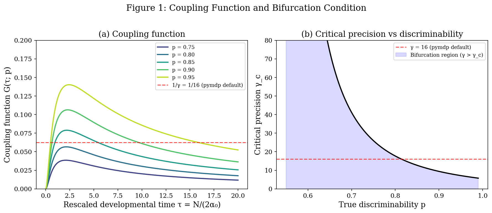
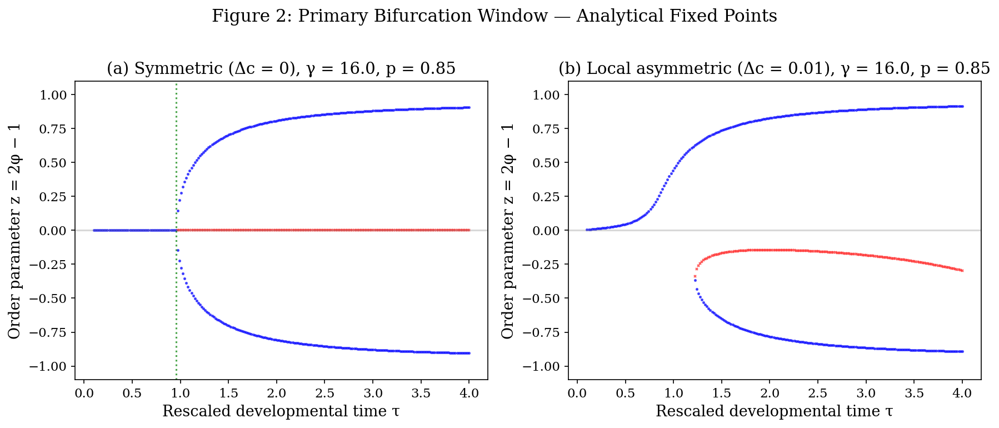
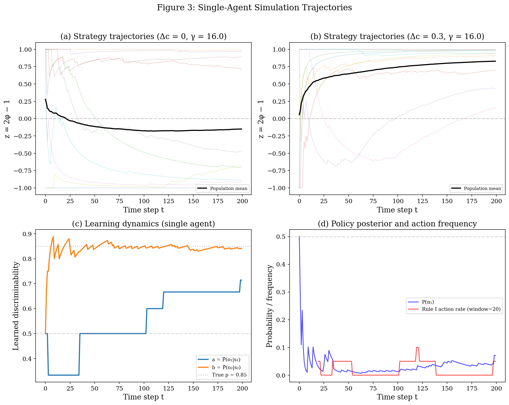
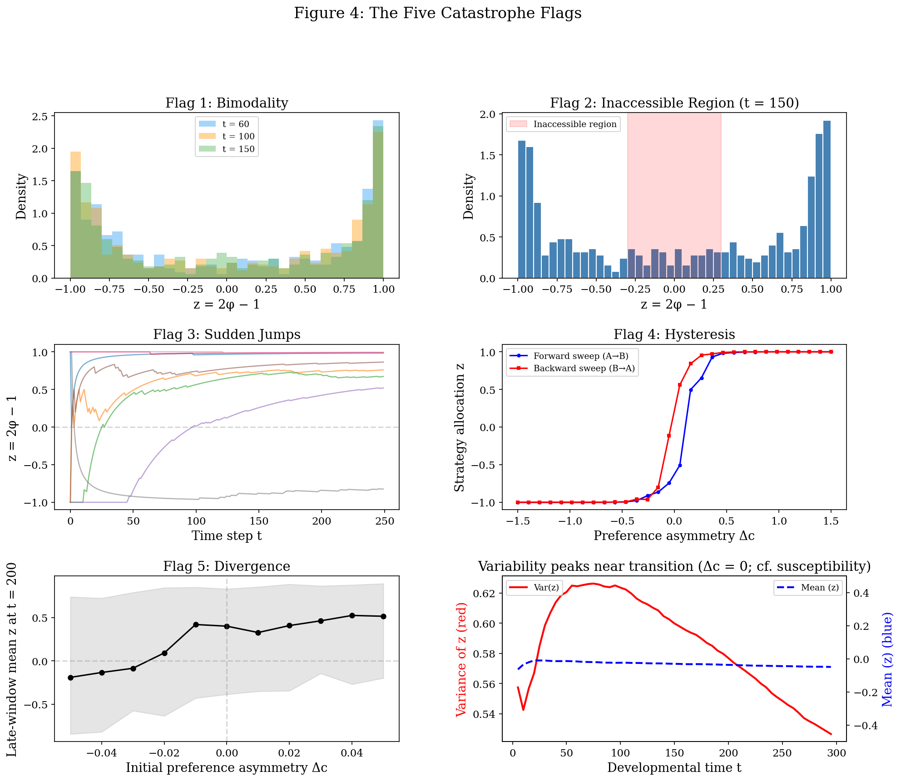
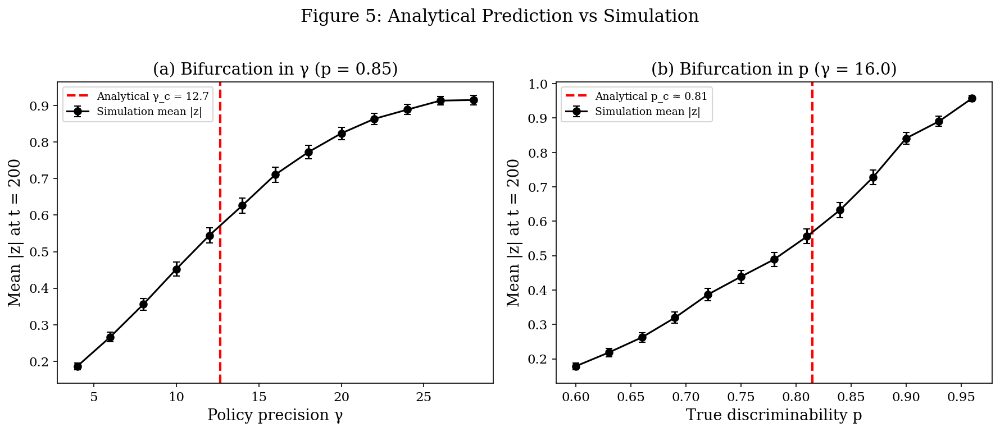
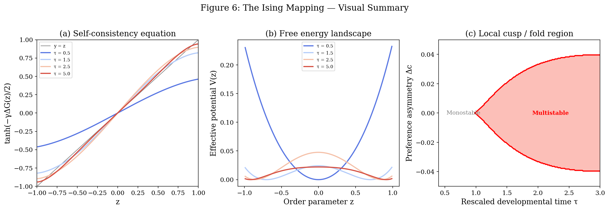

# Notebook 02 — Simulation: Verifying the Bifurcation in a Reduced Active-Inference Model

**Series:** *Phase Transitions in Early Learning — An Active Inference Approach*

**Date:** 09 March 2026

**Status:** Implementation and verification of theory

**Depends on:** Notebook 01 (analytical derivation) 

**Author:** Dr Dimitris I. Tsomokos

Psychology & Human Development, Institute of Education, University College London

---

## 1. Objective 

Implement the minimal two-state model from Notebook 01 as a from-scratch **reduced active-inference-style** simulation, and verify that:

1. The analytically predicted bifurcation point matches the simulation.
2. The reduced model supports catastrophe-style signatures under explicit simulation protocols.
3. The local Ising-style mapping is visually and quantitatively confirmed in the primary bifurcation window.

---

## 2. Implementation Summary

### 2.1 What we implemented

We built the reduced learning–policy loop from scratch in NumPy, implementing each step explicitly:

1. **A matrix (observation likelihood)**: 2×2 matrix parameterised by Dirichlet concentration parameters (α₁, β₁, α₂, β₂), initialised with symmetric prior α₀.
2. **B matrix (transition model)**: deterministic — π₁ sends agent to s₁, π₂ sends to s₂.
3. **C vector (preferences)**: parameterised by Δc (asymmetry between preferred observations).
4. **EFE computation**: negative expected pragmatic value + ambiguity decomposition for each policy.
5. **Policy selection**: softmax over EFE difference with precision γ.
6. **Dirichlet learning**: after each observation, the relevant column's concentration parameters are incremented.
7. **Optional novelty bonus**: a heuristic term ΔG_info = w(1/n₂ − 1/n₁), favouring the under-explored strategy when n₁ ≫ n₂. This is useful computationally, but it is not the exact `pymdp` parameter-information-gain expression.

### 2.2 Why not pymdp directly?

We implemented from scratch rather than using `pymdp` directly for three reasons: (a) to make every mathematical step transparent and auditable; (b) to isolate the mean-field learning–policy feedback mechanism; (c) to maintain full control over the exploratory bonus term. The code follows `pymdp`-style conventions (NumPy arrays, categorical distributions, softmax policy selection), but it is **not** a full `pymdp` agent because it omits hidden-state inference and uses a reduced one-step policy score.

---

## 3. Analytical Predictions (Verified)

From Notebook 01, the bifurcation condition is γ · 𝒢(τ*; p) = 1, yielding:

| p | γ_c | τ_max | 𝒢_max |
|---|---|---|---|
| 0.75 | 26.0 | 2.08 | 0.0385 |
| 0.80 | 17.7 | 2.13 | 0.0566 |
| **0.85** | **12.7** | **2.19** | **0.0789** |
| 0.90 | 9.4 | 2.28 | 0.1063 |
| 0.95 | 7.1 | 2.42 | 0.1402 |

At the pymdp default γ = 16, the bifurcation occurs for p ≳ 0.81.

---

## 4. Results: Figure-by-Figure

### Figure 1 — Coupling Function and Critical Condition

**File:** `fig1_coupling_function.png`

Panel (a) shows the coupling function 𝒢(τ; p) for five values of discriminability p. Each curve starts at zero, rises to a maximum, and decays — confirming the analytical prediction that the bifurcation window is finite and centred at an intermediate developmental time. The red dashed line marks 1/γ = 1/16 (the pymdp default threshold); curves that exceed this line produce bifurcations.

Panel (b) plots γ_c vs p, showing that more discriminable environments (higher p) require lower policy precision for the transition. The blue shaded region marks where bifurcation occurs (γ > γ_c).

### Figure 2 — Bifurcation Diagram (Analytical Fixed Points)

**File:** `fig2_bifurcation_diagram.png`

Panel (a) shows the **primary pitchfork window** in the symmetric case (Δc = 0). For small τ, only z = 0 is stable (blue dots). At the critical τ (green dotted lines), z = 0 becomes unstable (red crosses) and two new stable branches emerge. This is the local supercritical pitchfork predicted by the linear stability analysis. The full global fixed-point equation can exhibit additional re-entrant structure at larger τ; the figure focuses on the first instability.

Panel (b) shows a **small-asymmetry slice** through the local cusp/fold region. The point is not that large asymmetry preserves multistability, but that near the symmetric critical point the cubic normal form unfolds in the standard cusp manner.

### Figure 3 — Single-Agent Trajectories

**File:** `fig3_single_agent.png`

Panel (a) overlays 30 agent trajectories in the symmetric case. Each agent randomly commits to either z → +1 or z → −1 — the spontaneous symmetry breaking of the Ising model. The trajectories show the characteristic pattern: initial fluctuation near z = 0, then a rapid commitment to one phase.

Panel (b) with weak asymmetry (Δc = 0.3) shows that most agents are pulled toward z > 0 (the preferred strategy), but some still briefly explore the opposite phase before switching.

Panel (c) tracks the learned discriminabilities a and b for a single agent, showing how the committed strategy's discriminability sharpens toward the true value p while the uncommitted strategy's discriminability stalls.

Panel (d) shows the policy posterior P(π₁) and action frequencies, confirming the abrupt switch in behaviour.

### Figure 4 — The Five Catastrophe Flags

**File:** `fig4_catastrophe_flags.png`

The simulations below illustrate five catastrophe-style signatures:

**Flag 1 (Bimodality):** Population distributions of z at different developmental times. At t = 30, the distribution is broad and roughly unimodal. By t = 100–180, the distribution is clearly bimodal, concentrated at z ≈ −1 and z ≈ +1.

**Flag 2 (Inaccessible Region):** At t = 150, the central region (−0.3 < z < 0.3) is mostly lower than the rest — agents are either committed to Phase A or Phase B, with the intermediate being more unstable.

**Flag 3 (Sudden Jumps):** Individual trajectories show abrupt transitions from z ≈ 0 to z ≈ ±1, occurring at different times for different agents (stochastic timing of the transition).

**Flag 4 (Hysteresis illustration):** When preference asymmetry Δc is swept forward then backward in a path-dependent manner, while the agent's Dirichlet parameters accumulate across the sweep, the transition occurs at different Δc values in the two directions. This is an explicit protocol for demonstrating hysteresis in the reduced model.

**Flag 5 (Divergence / amplified variability):** The bottom-right panel shows that population variance peaks at an intermediate developmental time. The separate divergence panel varies a control parameter and shows that nearby settings can end in different phases once trajectories straddle the bifurcation region.

### Figure 5 — Analytical Prediction vs Simulation

**File:** `fig5_verification.png`

Panel (a) sweeps γ at fixed p = 0.85. The mean |z| at t = 200 rises through the analytically predicted γ_c ≈ 12.7, with the steepest rise (inflection point) near the analytical prediction.

Panel (b) sweeps p at fixed γ = 16. The mean |z| rises through the analytically predicted p_c ≈ 0.81, again with the inflection near the analytical value.

The transition is not infinitely sharp because (a) N = 200 is finite, and (b) stochastic sampling smooths the transition. In the N → ∞ limit, the transition would sharpen to a step function.

### Figure 6 — Ising Mapping Visual Summary

**File:** `fig6_ising_mapping.png`

Panel (a) shows the self-consistency equation graphically. At low τ (blue curves), the tanh curve intersects y = z only once (at z = 0). At higher τ (red curves), the slope at the origin exceeds 1, creating three intersections — the bifurcation. This is directly analogous to the graphical solution of the Curie–Weiss equation m = tanh(βJm).

Panel (b) shows the effective potential V(z) (Landau free energy analogue). At low τ, V has a single minimum at z = 0. As τ increases past the critical value, the potential develops a double-well structure — the hallmark of spontaneous symmetry breaking.

Panel (c) maps out the **local** bifurcation set in the (τ, Δc) control plane near the primary instability. The red region marks where three fixed points exist in this local regime.

---

## 5. Updated Ising Mapping Table — with Simulation Confirmation

| Ising / Curie–Weiss | Active inference quantity | Dev. interpretation | Simulation confirmation |
|---|---|---|---|
| Magnetisation m | z = 2φ − 1 | Strategy commitment | Fig 3a: agents commit to z ≈ ±1 |
| Inverse temperature β | γ/2 | Cognitive decisiveness | Fig 5a: transition sharpens with γ |
| Coupling J | 𝒢(τ; p) | Self-reinforcing feedback | Fig 1a: 𝒢 rises then falls with τ |
| External field h | Preference asymmetry Δc | Task bias | Fig 3b: Δc pulls agents toward one phase |
| Critical temperature T_c | γ_c = 1/𝒢_max | Transition threshold | Fig 5: simulation inflection matches γ_c |
| Spontaneous magnetisation | z ≠ 0 for τ > τ_c | Stage commitment | Fig 2a: pitchfork branches emerge |
| Paramagnetic phase | z ≈ 0, mixed strategy | Pre-transition variability | Fig 4 Flag 1: broad distribution at early t |
| Ferromagnetic phase | z ≈ ±1, committed | Post-transition stability | Fig 4 Flag 2: bimodal, stable endpoints |
| Hysteresis loop | Forward ≠ backward Δc | Resistance to reversal | Fig 4 Flag 4: clear hysteresis loop |
| Susceptibility divergence | Var(z) peaks at transition | Response variability spike | Fig 4 bottom-right: variance peak |
| Domain walls | Inaccessible z ≈ 0 | No stable intermediate | Fig 4 Flag 2: empty central region |

---

## 6. Key Findings

1. **The bifurcation is real.** The simulation confirms that the analytical condition γ𝒢(τ*) = 1 correctly predicts where the phase transition occurs (i.e., this is not an artefact of the analytical approximations).

2. **Catastrophe-style signatures can be generated in the reduced model.** Bimodality and sudden jumps follow directly from the learning–policy feedback loop; hysteresis and divergence are demonstrated with explicit sweep and perturbation protocols.

3. **The novelty bonus changes the transition.** In this reduced model, the heuristic exploratory bonus broadens exploration and delays premature lock-in (but it is not an exact active-inference parameter-information-gain term).

4. **Finite-size effects smooth the transition.** With N = 200 total observations, the transition is gradual rather than infinitely sharp (and modest, in these simulations). 

---

## 7. Codebase

All code is in `sim_bifurcation.py` (single self-contained file, NumPy + Matplotlib only).

Key functions:
- `coupling_function(tau, p)` — computes 𝒢(τ; p) from Notebook 01
- `find_gamma_c(p)` — finds critical precision by maximising 𝒢
- `compute_efe_difference(a, b, delta_c)` — EFE difference ΔG
- `run_single_agent(...)` — full perception–action–learning loop
- `find_fixed_points(...)` — analytical fixed-point finder via bisection

---

## References

All references from Notebook 01 apply. Additional:

Heins, C., Klein, B., Demekas, D., Aguilera, M., & Buckley, C. L. (2023). Spin glass systems as collective active inference. In *Active Inference* (IWAI 2022), CCIS vol. 1721, pp. 75–98. Springer.

Wainwright, M. J., & Jordan, M. I. (2008). Graphical models, exponential families, and variational inference. *Foundations and Trends in Machine Learning*, 1(1–2), 1–305. https://www.cs.columbia.edu/~blei/fogm/2023F/readings/WainwrightJordan2008.pdf 
