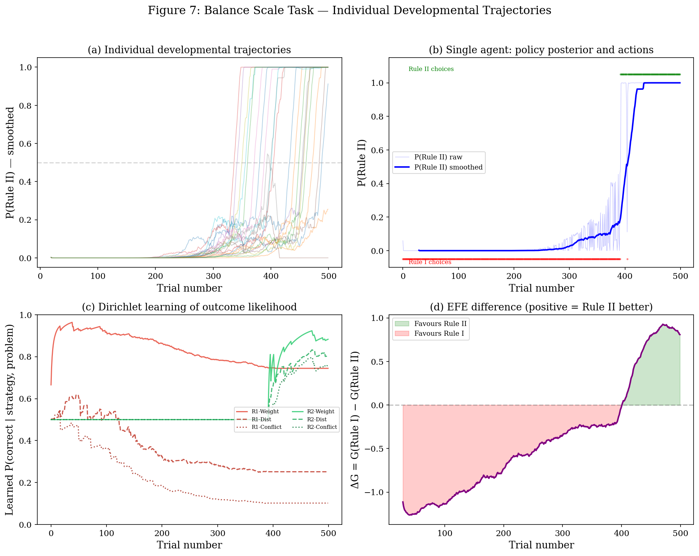
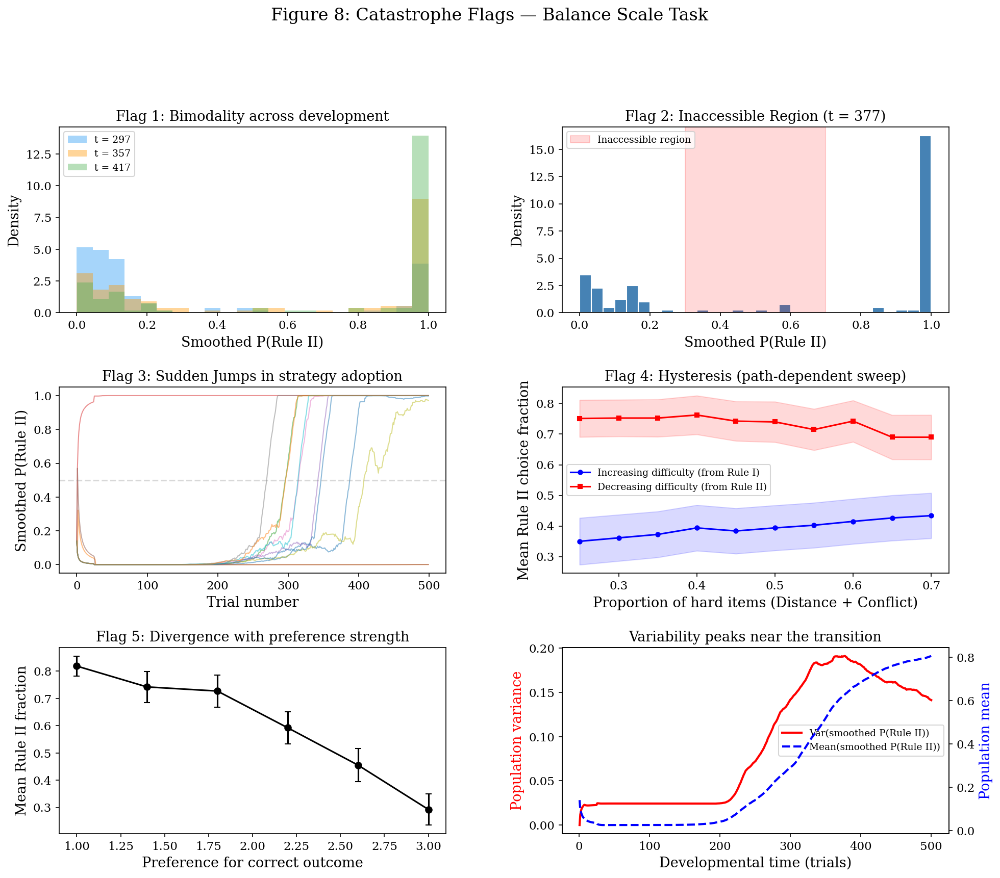
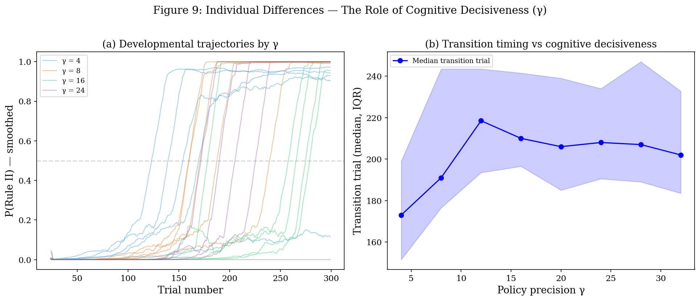
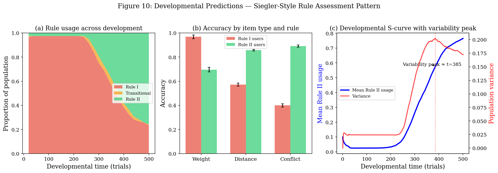

# Notebook 03 — The Balance Scale Task: Phase Transitions in a Developmentally Realistic Model

**Series:** *Phase Transitions in Early Learning — An Active Inference Approach*

**Date:** 09 March 2026

**Status:** A rich developmental model analysis

**Depends on:** Notebooks 01 (theory), 02 (minimal simulation)

**Author:** Dr Dimitris I. Tsomokos

Psychology & Human Development, Institute of Education, University College London

---

## 1. Objective 

Extend the minimal model from Notebooks 01–02 to a multi-factor, multi-modality POMDP-like model that captures the empirical structure of the **balance scale task** — the most studied paradigm for developmental stage transitions (Siegler, 1976; Jansen & van der Maas, 2001). The main model is `sim_balance_scale_pymdp.py`, which instantiates the task in the actual `pymdp` API with explicit hidden-state inference, policy inference, and Dirichlet learning on the outcome modality. The earlier reduced implementation is retained only as an appendix bridge model in `sim_balance_scale_appendix.py`, useful for intuition and continuity with the simplified derivation but not presented as the main rich-model implementation.

---

## 2. The Balance Scale Task

### 2.1 Empirical background

In Siegler's (1976) classic paradigm, children judge which side of a balance scale will tip down. Siegler identified a sequence of rules children use:

- **Rule I (weight-only):** judge by the number of weights, ignoring distance from the fulcrum.
- **Rule II (weight + distance):** judge by weight, but also consider distance when weights are equal.
- Rule III and IV involve more complex integration, not modelled here.

The transition from Rule I to Rule II is the canonical example of a developmental stage transition. Jansen & van der Maas (2001) demonstrated that four of five catastrophe flags (bimodality, inaccessible region, sudden jumps, hysteresis) are present in the Rule I → Rule II transition, supporting a cusp catastrophe model.

### 2.2 Problem types

Following Siegler (1976), balance scale problems are classified by which rule succeeds:

| Problem type | Rule I accuracy | Rule II accuracy | Description |
|---|---|---|---|
| **Weight items** | Very high (~0.97) | Moderate (~0.66) | Different weights, same distance |
| **Distance items** | Moderate (~0.58) | High (~0.87) | Same weight, different distance |
| **Conflict items** | Low (~0.40) | High (~0.92) | Weight and distance conflict |

Rule I dominates Weight items but is mediocre on Distance items and poor on Conflict items. Rule II trades some Weight accuracy for markedly better performance on hard items. The specific values are tuned to produce a clear developmental transition in simulation; the qualitative pattern — Rule I excels on Weight items, Rule II excels on Distance and Conflict items — follows the empirical Siegler (1976) structure. The developmental question is: what drives the transition from Rule I to Rule II?

---

## 3. Generative Model

### 3.1 Hidden state factors

| Factor | States | Controlled? | Interpretation |
|---|---|---|---|
| Strategy | {Rule I, Rule II} | Yes (by policy) | Which rule the child applies |
| Problem type | {Weight, Distance, Conflict} | No (environment) | Item classification |

### 3.2 Observation modalities

| Modality | Levels | Depends on | Interpretation |
|---|---|---|---|
| Outcome | {Correct, Incorrect} | Strategy × Problem type | Feedback on the child's answer |
| Item cue | {Weight-salient, Distance-salient, Mixed} | Problem type | Perceptual features of the problem |

### 3.3 A matrix (observation likelihood)

The A matrix for the outcome modality, A_outcome[outcome, strategy, problem_type], encodes the true success probabilities:

```
                  Weight  Distance  Conflict
Rule I  correct:  0.97    0.58      0.40
Rule II correct:  0.66    0.87      0.92
```

The A matrix for the cue modality depends primarily on problem type (not strategy), providing the child with partial information about what kind of problem they are facing.

### 3.4 B matrix (transition model)

Strategy transitions are policy-controlled (deterministic): π₀ → Rule I, π₁ → Rule II. Problem type transitions follow a stationary distribution reflecting the curriculum or environment. In the figures, a developmental curriculum shifts this distribution from predominantly easy (Weight) items early on to an increasing proportion of hard (Distance, Conflict) items later — see Section 3.7 and the reproducibility tables in Section 4 for the specific mixes used.

### 3.5 C vector (preferences)

Strong preference for Correct over Incorrect outcomes: C_outcome = [+2, −2] (log scale). No preference over cues.

### 3.6 Dirichlet learning

In the main `pymdp` implementation, the agent learns the outcome likelihood through Dirichlet parameter updating on the outcome modality only. Cue and phase modalities are treated as fixed parts of the generative model, while feedback on correctness updates the learnable mapping between strategy, problem type, and outcome. The developmental mechanism is therefore still the same in spirit: repeated evidence on Distance and Conflict items gradually teaches the agent that Rule I is unreliable on those latent item classes, which raises the policy score of Rule II and favours the switch.

### 3.7 Main-text implementation: proper `pymdp`

The main implementation used for this notebook is `sim_balance_scale_pymdp.py`. The true `pymdp` formulation requires one extra modelling ingredient that the reduced script does not: an explicit **within-trial phase factor**. This is necessary because, in the balance-scale task, the child first sees a cue about the item and only then chooses a strategy. A single-step model cannot preserve that temporal order.

The `sim_balance_scale_pymdp.py` model therefore represents each trial as two timesteps:

1. **Cue phase.** The agent observes the cue modality and infers $q(\text{problem type} \mid \text{cue})$.
2. **Outcome phase.** The agent receives correctness feedback after selecting Rule I or Rule II.

The hidden-state factors are:

- **Strategy**: $\{\text{Rule I}, \text{Rule II}\}$, controllable.
- **Problem type**: $\{\text{Weight}, \text{Distance}, \text{Conflict}\}$, latent and environment-driven.
- **Phase**: $\{\text{cue}, \text{outcome}\}$, deterministic.

The observation modalities are:

- **Outcome**: $\{\text{Correct}, \text{Incorrect}, \text{Null}\}$
- **Cue**: $\{\text{Weight-salient}, \text{Distance-salient}, \text{Mixed}, \text{Null}\}$
- **Phase observation**: deterministic cue/outcome indicator

This construction allows the agent to use `Agent.infer_states()` on the cue timestep, `Agent.infer_policies()` to evaluate Rule I versus Rule II for the next timestep, and `Agent.update_A()` to perform proper Dirichlet learning after the feedback timestep. When `use_param_info_gain=True`, the exploratory drive is the actual `pymdp` parameter-information-gain term.

Two further modelling choices should be made explicit here, as they are not emergent consequences of active inference alone. First, the problem distribution follows a developmental curriculum: early trials are dominated by Weight items and later trials contain more Distance and Conflict items. Second, the policy prior is itself scheduled across development: the agent begins with a strong Rule I habit and this prior relaxes toward a later, more balanced or mildly Rule II-favouring regime. The resulting transition is therefore scaffolded by both **learning from increasingly hard evidence** and an **externally specified prior schedule**.

### 3.8 Appendix bridge model

The earlier reduced script is retained as `sim_balance_scale_appendix.py`. It remains useful as a transparent bridge between the analytical toy model and the richer task formulation because it makes the cue-conditioned policy loop especially easy to inspect. However, it should now be treated as appendix / supplement material rather than as the main implementation. In particular, any claims in the main text about explicit active-inference state inference, policy inference, and parameter learning should refer to `sim_balance_scale_pymdp.py`.

---

## 4. Results

Unless otherwise stated, the rich-model results discussed in this notebook are intended to be generated from `sim_balance_scale_pymdp.py`, not from the appendix bridge model.

### Figure 7 — Individual Developmental Trajectories



Panel (a) shows 25 agent trajectories of P(Rule II) over 500 trials. Under the final parameterisation, the dominant pattern is **delayed but abrupt** adoption of Rule II: most agents remain near Rule I for an extended early period, then transition in the middle-to-late portion of the run. The spread in switching times reflects stochastic variation in the evidence each agent accumulates on Distance and Conflict items.

Panel (b) zooms in on a single representative agent, showing the raw and smoothed P(Rule II) alongside individual action choices. The transition from predominantly Rule I choices (red dots, bottom) to predominantly Rule II choices (green dots, top) is sharp and occurs only after a substantial learning period rather than immediately at the start of development.

Panel (c) tracks the Dirichlet learning of P(correct | strategy, problem_type) over time. The critical observation is not simply that Rule II is globally better, but that the agent gradually learns the **specific failure profile** of Rule I: Rule I remains highly reliable on Weight items, but its learned success on Distance and Conflict items drifts downward, while Rule II improves precisely on those harder item classes. This is the rich-model version of the learning-action feedback identified in Notebook 01.

Panel (d) shows the EFE difference ΔG = G(Rule I) − G(Rule II) becoming consistently positive only late in the run, at which point Rule II is favoured. The behavioural switch in panel (b) therefore coincides with a genuine change in policy score rather than arbitrary stochastic fluctuation.

**Reproducibility note.** Figure 7 is generated by `plot_individual_trajectories_pymdp()` using the default trajectory configuration in `_default_plot_config()`.

For presentation clarity, panel (a) omits rare agents whose smoothed Rule II posterior exceeds 0.9 within the first 25 trials. This filtering is only for that overview panel; it does not alter the underlying simulation or the other panels.

| Choice | Setting used |
|---|---|
| Trials / agents | 500 trials, 25 agents |
| Early item mix | (0.95, 0.03, 0.02) for Weight, Distance, Conflict |
| Late item mix | (0.06, 0.42, 0.52) |
| Policy precision | γ = 16 |
| Action precision | `alpha_action = 8` |
| Early policy bias | Rule I-biased (`policy_prior = (0.94, 0.06)`) |
| Late policy bias | Relaxed to (`late_policy_prior = (0.38, 0.62)`) by 40% of development |
| Learning regime | Curriculum on; parameter information gain on |

### Figure 8 — Catastrophe Flags in the Balance Scale Model



The simulations support the following catastrophe-style signatures:

**Flag 1 (Bimodality).** The population distribution of smoothed P(Rule II) is shown at three slices chosen around the empirically detected transition window. The distribution is concentrated near the extremes, with agents clustered either close to Rule I or close to Rule II and relatively little mass in the middle.

**Flag 2 (Inaccessible region).** At the variance peak of the population trajectory (t = 377 in the final simulation), intermediate Rule II fractions (0.3–0.7) are comparatively sparse relative to the near-0 and near-1 regimes.

**Flag 3 (Sudden jumps).** Individual smoothed P(Rule II) trajectories show rapid transitions at variable times, with some agents switching earlier and others later.

**Flag 4 (Hysteresis).** In a path-dependent sweep of environmental difficulty, agents pre-trained on easy items (Rule I experience) and then exposed to increasing difficulty show a different trajectory from agents pre-trained on hard items (Rule II experience) and then exposed to decreasing difficulty. The Dirichlet parameters accumulate across the sweep, so the agent's response at each difficulty level depends on its full history of prior experience. The forward and backward curves separate, demonstrating genuine hysteresis: the difficulty threshold at which Rule II is adopted depends on the direction of the sweep. To make this regime visible, the hysteresis protocol uses a deliberately **softer payoff table** than the main developmental figure, so that path dependence is not overwhelmed by a large built-in Rule II advantage.

**Flag 5 (Divergence) and variability peak.** Increasing preference for correct outcomes changes the mean late-stage Rule II fraction systematically; in the final scaffolded model, stronger preference tends to reinforce the early Rule I advantage and can therefore delay or reduce later Rule II adoption. Meanwhile, the population variance of smoothed P(Rule II) peaks at an intermediate developmental time before declining, corresponding to the susceptibility-style maximum near the transition window.

**Reproducibility note.** Figure 8 is generated by `plot_catastrophe_flags_pymdp()` using `_catastrophe_plot_config()`.

| Choice | Setting used |
|---|---|
| Trials / agents | 500 trials, 120 agents |
| Config focus | Slightly softer early Rule I bias than Figure 7 |
| Policy precision | γ = 14 |
| Action precision | `alpha_action = 6` |
| Curriculum | Early mix (0.93, 0.04, 0.03) to later mix (0.08, 0.42, 0.50) |
| Flag 1 slices | Chosen adaptively around the variance peak |
| Flag 4 payoff table | Modified: Rule I = (0.90, 0.64, 0.52), Rule II = (0.74, 0.76, 0.82) |
| Flag 4 summary | Mean Rule II choice fraction under forward vs backward difficulty sweeps |

### Figure 9 — Individual Differences: The Role of γ



Panel (a) shows that low-γ agents (γ = 4) transition gradually and noisily, whereas higher-γ agents transition more sharply. The key qualitative effect is not that higher γ always means earlier development in a strict monotonic sense, but that greater cognitive decisiveness yields **cleaner commitment** once the evidence for Rule II becomes sufficiently strong.

Panel (b) quantifies transition timing with the median transition trial and interquartile range across agents. The central tendency shifts modestly with γ, but the more important effect is that γ changes the **sharpness and coherence** of the developmental transition rather than acting as a simple linear accelerator. In this scaffolded model, that effect is compound: larger γ also implies larger action precision (`alpha_action = γ`), so higher decisiveness can strengthen early Rule I commitment before later evidence shifts the balance toward Rule II.

This more conservative two-panel presentation is preferable to the earlier distributional summaries because, in the rich `pymdp` model, fixed-time population slices were too sensitive to saturation and therefore visually overstated the precision effect.

**Reproducibility note.** Figure 9 is generated by `plot_individual_differences_pymdp()` using `_individual_differences_config()`.

| Choice | Setting used |
|---|---|
| Trials | 300 |
| γ values in panel (a) | 4, 8, 16, 24 |
| γ range in panel (b) | 4 to 32 in steps of 4 |
| Base environment | Early Rule I-biased curriculum with later hard-item increase |
| Action precision | Set equal to γ in this comparison |
| Transition estimate | Threshold-crossing of smoothed P(Rule II) |

### Figure 10 — Developmental Predictions: Siegler Rule Assessment Pattern



Panel (a) shows the proportion of the population classified as Rule I, Transitional, or Rule II across development using a **usage-based proxy derived from smoothed P(Rule II)**, not a full Siegler-style latent rule classification. The stacked area plot still shows the classic pattern: Rule I users declining, a brief transitional period, and Rule II users increasing.

Panel (b) reproduces the key Siegler contrast in a simplified form: agents classified as Rule I users have high accuracy on Weight items but low accuracy on Distance and Conflict items, whilst Rule II users have more uniform accuracy across item types.

Panel (c) shows the developmental S-curve (mean Rule II usage vs time) with a superimposed variance peak marking the transition window. The variance maximum indicates the moment of maximal individual differences — when some children have already transitioned whilst others have not.

**Reproducibility note.** Figure 10 is generated by `plot_siegler_predictions_pymdp()` using `_siegler_plot_config()`.

| Choice | Setting used |
|---|---|
| Trials / agents | 500 trials, 120 agents |
| Policy precision | γ = 14 |
| Action precision | `alpha_action = 7` |
| Rule classification | Usage-based classification from smoothed P(Rule II) |
| Curriculum | Early easy-item dominance followed by increased hard-item exposure |

---

## 5. Mapping to the Ising Model — Updated for the Rich Model

The Ising mapping from Notebooks 01–02 extends cleanly to the multi-factor model:

| Ising / Curie–Weiss | Balance scale model | Developmental meaning |
|---|---|---|
| **Magnetisation m** | Rule II usage fraction (0 to 1) | How consistently the child uses the advanced rule |
| **Inverse temperature β** | γ (policy precision) | Cognitive decisiveness; how firmly the child commits |
| **Coupling J** | Learned discriminability difference between Rule I and Rule II, weighted by problem type frequencies | The self-reinforcing feedback: using Rule II → more evidence it works → stronger preference for Rule II |
| **External field h** | Preference for correct outcomes × (Rule II advantage on hard items) | The built-in asymmetry: Rule II is objectively better on most items |
| **Critical temperature T_c** | γ_c from the multi-factor coupling function | The threshold of cognitive decisiveness needed for a sharp transition |
| **Spontaneous magnetisation** | Commitment to Rule II | Child settles into consistent Rule II usage |
| **Paramagnetic phase** | Rule I usage or mixed responding | Pre-transition state: child is inconsistent, using both rules |
| **Ferromagnetic phase** | Consistent Rule II usage | Post-transition state: stable, stage-typical Rule II behaviour |
| **Hysteresis** | Resistance to reverting from Rule II to Rule I when problem mix changes | Once a child masters Rule II, they do not easily revert |
| **Susceptibility peak** | Variance of Rule II usage peaks at the transition | Maximum individual differences at the transition point |

### 5.1 Key extension beyond the minimal model

In the two-state model (Notebooks 01–02), the coupling was symmetric (both strategies equally "discoverable"). In the balance scale model, the asymmetry is intrinsic to the task: Rule II is objectively better than Rule I on most item types. This means the "external field" h ≠ 0, and the transition is biased toward Rule II — matching the empirical observation that children progress from Rule I to Rule II (not the reverse). It also means the richer model is driven more by task asymmetry and cue-conditioned inference than by the perfectly symmetric ambiguity mechanism of the minimal toy model.

The rate-limiting factor for the transition is no longer pure symmetry-breaking but rather the rate at which the agent accumulates evidence about Rule I's failure on Distance and Conflict items. This depends on:

1. **Environmental richness** — how many hard items (Distance, Conflict) the child encounters.
2. **Exploration / novelty pressure** — whether the child samples Rule II on items where Rule I seems adequate.
3. **Cognitive decisiveness (γ)** — whether the child acts on emerging evidence or continues hedging.

---

## 6. Testable Predictions

The model generates several predictions that go beyond the existing catastrophe-theory account:

1. **Transition timing is jointly determined by γ and problem mix.** Children in environments with more Distance/Conflict items should transition earlier. Children with higher cognitive decisiveness should transition more sharply.

2. **The transition is preceded by increased variability.** Just before the switch to Rule II, the child should show inconsistent responding — sometimes using Rule I, sometimes Rule II. This is the "susceptibility peak" and matches empirical findings (Siegler, 1996; van der Maas & Molenaar, 1992).

3. **Hysteresis predicts asymmetric curriculum effects.** A child exposed to a hard curriculum (many Distance/Conflict items) followed by an easy curriculum (mostly Weight items) should maintain Rule II longer than a child who was only ever exposed to the easy curriculum. This is because the Dirichlet parameters accumulated during the hard phase create a persistent memory of Rule II's superiority. This is testable with a two-phase experimental design.

4. **Individual differences in γ predict transition sharpness.** Children with higher attentional precision / less noisy policy selection should show more abrupt transitions. This could be operationalised via measures of response consistency or executive function.

5. **Exploration modulates the transition rather than creating it from nothing.** In the main `pymdp` implementation, enabling parameter information gain should accelerate or stabilise the shift toward Rule II, but the transition need not disappear entirely without it because Rule II has a real pragmatic advantage on hard items. The empirical prediction is therefore graded: more exploratory children should transition earlier or more reliably.

---

## 7. Codebase

- `sim_balance_scale_pymdp.py` — main implementation in this research project: proper `pymdp` model with explicit hidden-state inference, policy inference, and Dirichlet learning across cue/outcome phases
- `sim_balance_scale_appendix.py` — appendix bridge model retained for intuition and continuity with the reduced derivation

Key classes and functions:
- `BalanceScalePymdpEnv` — generative process for the proper `pymdp` port
- `build_balance_scale_agent()` — constructs the actual `pymdp.Agent` with factorized `A/B/C/D/pA`
- `run_balance_scale_pymdp()` — two-step-per-trial active-inference loop using `infer_states`, `infer_policies`, `sample_action`, and `update_A`
- `generate_all_figures()` — main entrypoint for producing the Figure 7–10 outputs from the proper `pymdp` model
- `BalanceScaleModel` — reduced generative model specification used in `sim_balance_scale_appendix.py`
- `run_balance_scale_agent()` — reduced single-agent perception–action–learning loop kept for appendix use

---

## References

Refer to complete list in Notebook_01_Bifurcation_Conditions.md https://github.com/dtsomoucl/phase-transitions-in-active-inference/blob/main/notebooks/Notebook_01_Bifurcation_Conditions.md
